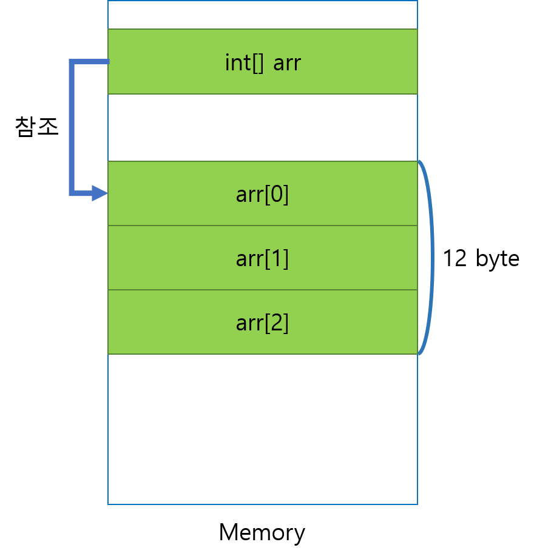
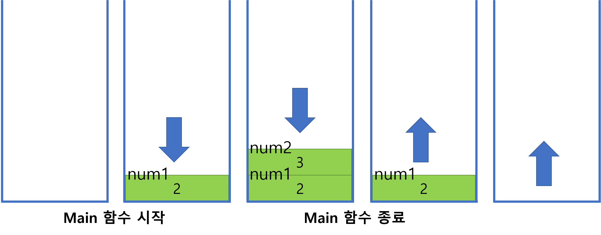
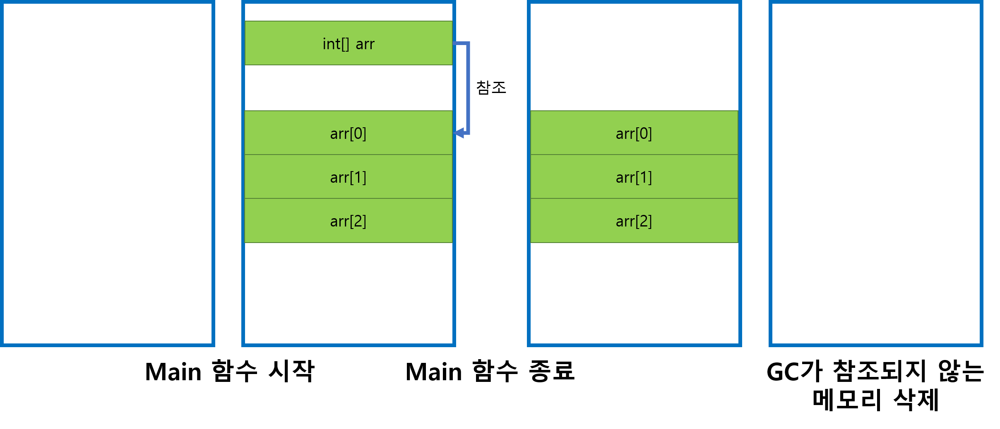

# 프로그래밍 기초 개념 정리

## 변수와 타입 

type: [ int, float, double, char ]

int: 정수 (4byte)
float: 소수점 (4byte)
double: 소수점(8byte)
char: 문자(1byte)

```
// 변수 선언
타입 변수이름;

// 변수 선언과 동시에 초기화
타입 변수이름 = 값;
```

1. 메모리를 타입의 크기만큼 할당한다.
2. 할당한 메모리에 별명을 붙인다.
3. 별명을 이용해 할당한 메모리에 값을 변경하거나 참조할 수 있다.

## 연산자

모든 기본 타입에는 기본 연산자가 존재한다.

숫자 타입 기본 연산자: `+`, `-`, `*`, `/`

```csharp
Console.WriteLine(3 + 4); // 7
Console.WriteLine(2 / 1); // 2
```

연산 결과는 타입에 맞게 나온다.

```csharp
int num = 3;
int num2 = 2;
Console.WriteLine(num / num2); // 1 (소수점 잘림)
```

## 형변환

형변환은 명시적 형변환과 암시적 형변환이 있다.

### 명시적 형변환

`(타입) 값` 형태로 명시적으로 타입 변환을 하겠다고 선언하는 것

```csharp
char a = 'a';

Console.WriteLine((int)a); // 97 (명시적 형변환)
```

### 암시적 형변환

운영체제가 알아서 서로 다른 타입을 호환시키는 것

```csharp
char a = 'a';

Console.WriteLine(a + 1); // 98 (int로 암시적 형변환)
```

## 입출력

C#에 입력, 출력 함수가 내장이 돼있다.

`위치: System.Console`

C#의 입출력 함수는 `Console`이라는 묶음에 저장이 되어있고, C#에 기본적으로 포함이 돼있다.

```csharp
Console.Write("값을 입력해주세요: ");
string str = Console.ReadLine();
Console.WriteLine(str);
```

## 배열

배열 선언은 아래와 같은 문법으로 한다.

```csharp
// <type>[] <name>;
int[] arr;
```

생성과 동시에 동적할당은 아래와 같이 한다.

```csharp
// <type>[] <name> = new <type>[<size>];
int[] arr = new int[3];

// 생성과 동시에 초기화
int[] arr = new int[3] { 2, 4, 6 };
```

위 코드를 그림으로 표현하면 아래와 같다.



위 그림처럼 `int[] arr`은 배열 데이터의 메모리를 가리키는 `Reference`이고, `new int[3]`으로 생성된 메모리가 실제 배열 데이터가 저장되는 곳이다.

### 스택과 힙

C#의 논리적 메모리는 두개로 나뉜다. `Stack`, `Heap`

#### Stack

`Stack`은 일반적으로 함수나 반복문과 같이 `{ }` 안에 선언된 변수를 말한다.
이 변수들을 `지역변수`라고 한다. 중괄호가 끝나면 메모리에서 삭제된다.

```csharp
static void Main(string[] args)
{
	int num1 = 2;
	int num2 = 3;
	Console.WriteLine(num1); // 2
	Console.WriteLine(num2); // 3
}
```

위 코드에서 `지역변수`가 스택에 쌓였다가 삭제되는 과정을 그림으로 표현하면 아래와 같다.



#### Heap

`Heap`은 `new` 키워드로 생성된 메모리이다. 이 메모리는 참조하는 변수가 있지 않으면 `Garbage Collector (GC)`가 삭제한다.

```csharp
static void Main(string[] args)
{
	int[] arr = new int[3];
	arr[0] = 2;
	arr[1] = 4;
	arr[2] = 6;

	Console.WriteLine(String.Format("첫번째: {0}, 두번째: {1}, 세번째: {2}", arr[0], arr[1], arr[2]));
}
```

위 코드에서 `new` 키워드로 생성한 메모리를 참조하는 `Reference`가 더이상 존재하지 않게되어 메모리에서 삭제되는 과정을 그리면 아래와 같다.


