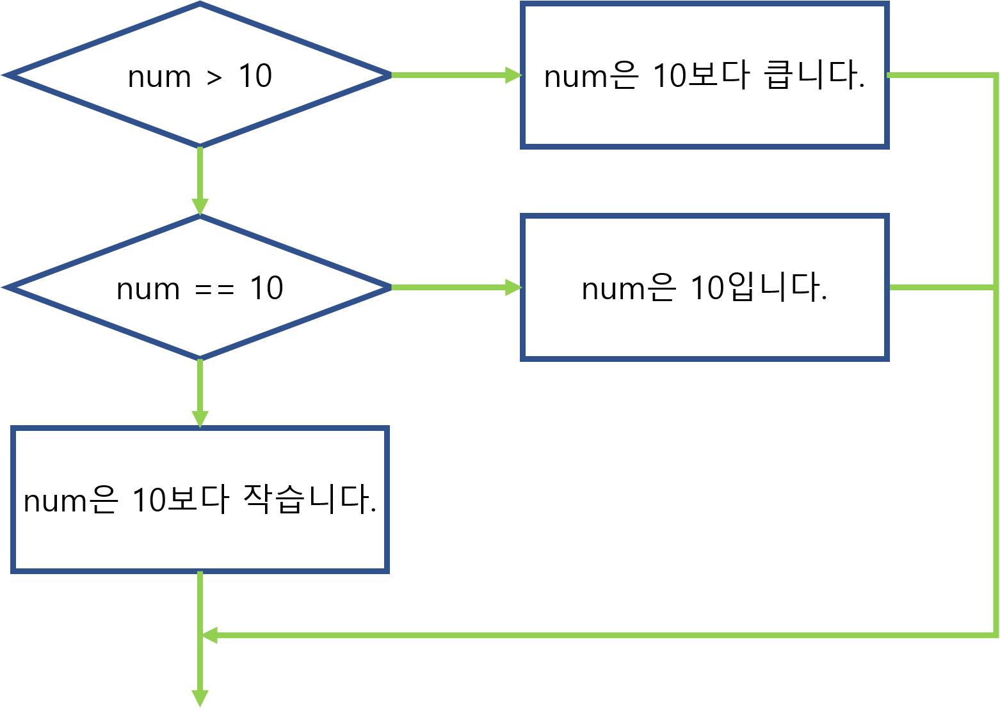

# 프로그래밍 기초 개념 정리

## 변수와 타입 

type: [ int, float, double, char ]

int: 정수 (4byte)
float: 소수점 (4byte)
double: 소수점(8byte)
char: 문자(1byte)
bool: true, flase

```
// 변수 선언
타입 변수이름;

// 변수 선언과 동시에 초기화
타입 변수이름 = 값;
```

1. 메모리를 타입의 크기만큼 할당한다.
2. 할당한 메모리에 별명을 붙인다.
3. 별명을 이용해 할당한 메모리에 값을 변경하거나 참조할 수 있다.

## 연산자

모든 기본 타입에는 기본 연산자가 존재한다.

숫자 타입 기본 연산자: `+`, `-`, `*`, `/`

```csharp
Console.WriteLine(3 + 4); // 7
Console.WriteLine(2 / 1); // 2
```

연산 결과는 타입에 맞게 나온다.

```csharp
int num = 3;
int num2 = 2;
Console.WriteLine(num / num2); // 1 (소수점 잘림)
```

## 형변환

형변환은 명시적 형변환과 암시적 형변환이 있다.

### 명시적 형변환

`(타입) 값` 형태로 명시적으로 타입 변환을 하겠다고 선언하는 것

```csharp
char a = 'a';

Console.WriteLine((int)a); // 97 (명시적 형변환)
```

### 암시적 형변환

운영체제가 알아서 서로 다른 타입을 호환시키는 것

```csharp
char a = 'a';

Console.WriteLine(a + 1); // 98 (int로 암시적 형변환)
```

## 입출력

C#에 입력, 출력 함수가 내장이 돼있다.

`위치: System.Console`

C#의 입출력 함수는 `Console`이라는 묶음에 저장이 되어있고, C#에 기본적으로 포함이 돼있다.

```csharp
Console.Write("값을 입력해주세요: ");
string str = Console.ReadLine();
Console.WriteLine(str);
```

## 배열

배열 선언은 아래와 같은 문법으로 한다.

```csharp
// <type>[] <name>;
int[] arr;
```

생성과 동시에 동적할당은 아래와 같이 한다.

```csharp
// <type>[] <name> = new <type>[<size>];
int[] arr = new int[3];

// 생성과 동시에 초기화
int[] arr = new int[3] { 2, 4, 6 };
```

위 코드를 그림으로 표현하면 아래와 같다.


위 그림처럼 `int[] arr`은 배열 데이터의 메모리를 가리키는 `Reference`이고, `new int[3]`으로 생성된 메모리가 실제 배열 데이터가 저장되는 곳이다.

배열에 할당된 각각의 요소에 접근하려면 `<array name>[<index>]` 형태로 접근해야 한다.

```csharp
int[] arr = new int [5] { 2, 4, 6, 8, 10 };

// 3번째 요소를 11로 수정
arr[2] = 11;

// 4번째 요소를 출력
Console.WriteLine(String.Format("네번째 요소는 {0}", arr[3]));
```

### 스택과 힙

C#의 논리적 메모리는 두개로 나뉜다. `Stack`, `Heap`

#### Stack

`Stack`은 일반적으로 함수나 반복문과 같이 `{ }` 안에 선언된 변수를 말한다.
이 변수들을 `지역변수`라고 한다. 중괄호가 끝나면 메모리에서 삭제된다.

```csharp
static void Main(string[] args)
{
	int num1 = 2;
	int num2 = 3;
	Console.WriteLine(num1); // 2
	Console.WriteLine(num2); // 3
}
```

위 코드에서 `지역변수`가 스택에 쌓였다가 삭제되는 과정을 그림으로 표현하면 아래와 같다.


#### Heap

`Heap`은 `new` 키워드로 생성된 메모리이다. 이 메모리는 참조하는 변수가 있지 않으면 `Garbage Collector (GC)`가 삭제한다.

```csharp
static void Main(string[] args)
{
	int[] arr = new int[3];
	arr[0] = 2;
	arr[1] = 4;
	arr[2] = 6;

	Console.WriteLine(String.Format("첫번째: {0}, 두번째: {1}, 세번째: {2}", arr[0], arr[1], arr[2]));
}
```

위 코드에서 `new` 키워드로 생성한 메모리를 참조하는 `Reference`가 더이상 존재하지 않게되어 메모리에서 삭제되는 과정을 그리면 아래와 같다.


## 조건문

C#의 조건문은 `if`와 `switch` 구문으로 사용할 수 있다.

### if

`if`를 이용하여 분기처리하는 코드는 아래와 같다.

```csharp
/**
 * if (<condition>)
 * {
 *     ...
 * }
 * else if (<condition>)
 * {
 *     ...
 * }
 * else
 * {
 *     ...
 * }
 */

int num = 10;
if (num > 10) // false
{
	Console.WriteLine("num은 10보다 큽니다.");
}
else if (num == 10) // true
{
    Console.WriteLine("num은 10입니다.");
}
else
{
	Console.WriteLine("num은 10보다 작습니다.");
}
```

위 코드를 그림으로 표현하면 아래와 같다.



### switch

`switch`를 이용하여 분기처리하는 코드는 아래와 같다.

```csharp
/**
 * switch (<value>)
 * {
 * case <condition>:
 *     ...
 *     break;
 * case <condition>:
 *     ...
 *     break;
 * default:
 *     ...
 *     break;
 * }
 */

string str = "준혁";
switch (str)
{
case "영준":
	Console.WriteLine("영준이는 24살입니다.");
	break;
case "윤창":
	Console.WriteLine("윤창이는 29살입니다.");
	break;
case "준혁":
	Console.WriteLine("준혁이는 29살입니다.");
	break;
default:
	Console.WriteLine("나이를 알수가 없습니다.");
	break;
}
```

`switch`는 `if ... else if ... else` 구문과 동일한 순서도를 가지므로 그림은 생략한다.

각 분기마다 `break`를 반드시 포함해야 한다는 것을 잊지말자.

## 문자열

문자열(`string`)은 일반 기본 타입과 달리 문자의 배열로 구성되어있는 타입이다.

```csharp
string str = "Hello";
char[] strChars = str.toCharArray();

// 문자열의 첫번째 요소 출력
Console.WriteLine("str의 첫번째 문자: {0}", strChars[0]);

// 문자 배열로부터 문자열 초기화
char[] from = new char[] { 'a', 'b', 'c' };
str = new string(from);
Console.WriteLine("문자 배열로부터 초기화한 문자열: {0}", str);
```

문자열 변수는 다양한 함수를 가지고 있는데 이 중 몇가지 자주 사용하는 함수만 소개한다.

```csharp
string str = "Hello World";

// 문자열을 인덱스로 나누기
// str.Substring(인덱스, 길이);
string worldStr = str.Substring(7, 5); // 인덱스 7부터 5개의 문자를 가져온다

// 문자열에서 문자 또는 문자열 찾기
int whiteSpaceIndex = str.IndexOf(' ');
string helloStr = str.Substring(0, whiteSpaceIndex);
Console.WriteLine("Hello str: {0}", helloStr);


// 문자열 구분자로 나누기
string[] strs = str.split(" ");
Console.WriteLine("첫번째: {0}, 두번째: {1}", strs[0], strs[1]);
```

## 반복문

똑같은 코드를 여러번 반복해서 입력하지 않고 처리하는 구문

### for 

`for`문은 초기화, 조건문, 후처리 단계로 나뉜다.

```csharp
// for (init; condition; post)
for (int i = 0; i < 10; i++)
{
	Console.WriteLine("인덱스는 {0}입니다.", i);
}
```

위의 코드를 설명하면,

 * 초기화: `int` 타입의 변수 i가 0으로 초기화되며 생성
 * 조건문: i 가 10보다 작을때까지 코드를 반복
 * 후처리: 코드를 반복할 때마다 i가 1씩 증가

### while

`while`문은 조건문만 가지는 반복문이다.

```csharp
int i = 0;
while (i < 10)
{
	Console.WriteLine("인덱스는 {0}입니다.", i);
	i++;
}
```


## 객체(Object)

```
상태(state)와 행동(behavior)을 지니고 있다.
상태는 데이터(변수)로, 행동은 메소드로 표현

즉, 객체는 데이터와 메소드로 이루어진다.

예) 붕어빵을 만들기위한 틀(클래스) 하나로 붕어빵(객체)을 여러 개 찍어내는 것
```

##삼항연산자
int a = (5 < 3) ? 50 : 40;
          조건문 / 참 / 거짓

5는 3보다 작다? 거짓이다
System.out.printIn(a); // 40

주의사항
1. 삼항연산자를 사용하여 코드의 라인이 줄어들었다고 컴파일 속도가 빨라지는 것은 아닙니다.
2. 삼항연산자를 중복해서 처리할 경우. 가독성이 떨어질 수 있으므로 중복처리는 피하는것이 좋습니다.


## 기타 메모

list.toArray 복사해서 똑같은 배열로 만듦

toCharArray 문자 하나하나를 배열로

타입.ToString 문자열 //.Length

Reverse 뒤집기

foreach = for와 같은 반복문 

isEmpty = 객체가 비여있는지 확인
while(!queue.isEmpty()) = 큐를 더 이상 꺼낼 수 없을 때 까지 반복

컨트롤 쉬프트 f = 정렬

if (p[i].equals(c[i])) p랑 c랑 같은지 비교
문자나 객체를 비교할 때는 == 가 아닌 equals (equalsignorecase 대소문자를 구분하지 않음)

compareTo() = 사전순 정렬
Arrays.sort(arr, (o1, o2) -> (o2 + o1).compareTo(o1 + o2));
= (o2 + o1)값과 (o1 + o2) 값 비교 (o2 + o1)값이 더 크면 1을 출력 그러므로 o2는 앞으로 감

Collections.sort(list); = Arraylist 오름차순 정렬
Collections.reverse(list); = 정렬 후 뒤집음
Collections.sort(list, Collections.reverseOrder()); = 내림차순 정렬


split = 해당 문자로 나눔
String input = 010-8877-1234;
String maze = input.split(" - ");
printIn(maze) = 010	8877	1234 출력
 

알트 쉬프트 a  = 코드 블록 선택 

System.out.println(String.format("%.3f", array[i])); //   소수점 3번째 자리까지 출력
Integer.parseInt = int형 변환
String.valueOf() = 문자열 변환, null이면 "null"이라는 문자열로 처리

map.put(name, map.getOrDefault(name, 0)+1)	//    key값이 같으면 + 1 (중복 처리)	

int max = Math.max(a, b);     //   최대값 출력
Math.abs(num) 		//    절대값 num이 나옴

input = "  Hello world a  "
String inputtrim = input.trim();  을 하면    "Hello world a"  =  공백을 제거해서 문자열 출력	

str = 12345
str.charAt(Index) - '0' = Index값에 따라 int 형 1, int 형 2 ... 출력

String[] arr= {"1", "2", "3"};
int[] nums = Arrays.stream(arr).mapToInt(Integer::parseInt).toArray();	// string 배열을 int형으로 변환

int[] nums = Arrays.stream(arr).mapToInt(Integer::parseInt).sorted().toArray()
정렬까지 가능

Arrays.fill(arr, 1);	 //     arr배열의 모든 값을 1로 바꿔버림
Arrays.fill(arr, 3, 7,-1);  // 3부터 6 index 까지만 -1로 채움

이중 for문 하나만 탈출할 때는 break 둘다 탈출할 때는 break loop

배열의 크기가 크고, 배열의 요소들의 순서가 난수처럼 들쑥날쑥일때는 ParallelSort가 빠르다
큰 데이터 처리에는 ParallelSort 작은 데이터 처리에는 sort

String str = bufferedReader.readLine().replace(".", "z")  //  ab.c가 abzc로 변경됨

map.containsKey(key)
맵에서 인자로 보낸 키가 있으면 true 없으면 false를 반환

map.containsValue(value)
맵에서 인자로 보낸 값이 있으면 true 없으면 false를 반환

startsWith/endsWith (특정 문자로 시작하거나 끝나는지 체크)

List<Point> list = new ArrayList<>(); 정렬 하는 방법
Collections.sort(list, (Point p1, Point p2) -> p1.y > p2.y ? 1 : -1);

Collections.sort(list, (Point p1, Point p2) -> {
            if(p1.x == p2.x){
                return p1.y - p2.y;
            } else {
                return p1.x - p2.x;
            }
        });


1차원 배열 문자열 기준 정렬
Arrays.sort(arr, new Comparator<String>() {
            public int compare(String e1, String e2) {
                if(e1.length() == e2.length()) {
                    return e1.compareTo(e2);
                }else {
                    return e1.length() - e2.length();
                }
            }
});


2차원 배열 x 기준 정렬
Arrays.sort(arr, (e1, e2) -> {
	if(e1[0] == e2[0]){
		return e1[1] - e2[1];
	}else{
		return e1[0] - e2[0];
	}
});


list.stream().mapToInt(Integer::intValue).sum();   //리스트 int값 모두 합하기
int sum = IntStream.of(arr).sum();                  // 배열 int값 모두 합하기

<<<<<<< HEAD
문자열 char 배열 넣기
i = "str"
char[] char_arr = String.valueOf(i).toCharArray();
char_arr[0] = "s", char_arr[1] = "t", char_arr[2] = "r"  


몫과 나머지 구하기
몫 : Math.floorDiv(26,10) = 2
나머지 : Math.floorMod(26,10) = 6


ArrayList 복사하는 방법
list2.addAll(list)

list 내용 삭제
list.clear();
